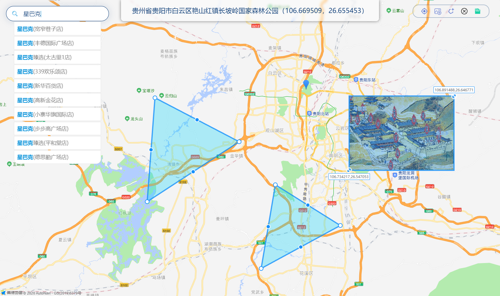

# coord-picker / 坐标拾取



### Feature / 特性

- √ 坐标拾取（双向绑定）
- √ 拖拉拽绘制/编辑图片图层（双向绑定角坐标）
- √ 拖拉拽绘制/编辑多边形（双向绑定轮廓坐标）
- √ POI搜索、搜索关键字自动补全
- √ 支持全局安装/单独引入
- √ 定位灵活：根据传参情况智能初始化至合适的位置

- 坐标系：高德/腾讯地图通用的GCJ-02
- 高德JS-API版本：1.4.15（曾采用动态版本，但2.0存在诸多问题，性能也不如1.x，等待后续更新吧）


### Installation / 安装
```
yarn add coord-picker / npm i coord-picker
依赖项：vue element-ui plain-kit

全局引入：
import 'coord-picker/dist/coord-picker.css'
import CoordPicker from 'coord-picker'
Vue.use(CoordPicker)

局部引入：
import 'coord-picker/dist/coord-picker.css'
import { CoordPicker } from 'coord-picker'
components: { CoordPicker }
```


### Quick Start / 快速上手
```
请参考/demo中极简示例
```
