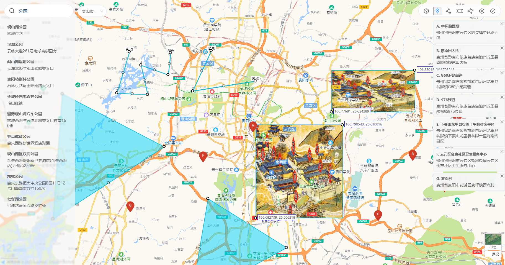

# coord-picker / 坐标拾取



## Features

- √ 坐标拾取（双向绑定）
- √ 拖拉拽绘制/编辑图片图层（双向绑定角坐标）
- √ 拖拉拽绘制/编辑多边形（双向绑定轮廓坐标）
- √ POI搜索、搜索关键字自动补全
- √ 根据传参情况智能初始化至合适的位置
- √ 全局或局部引入 参数支持全局或局部配置

<br>

## Installation


Dependencies: vue element-ui

```ts
// 全局引入

import 'coord-picker/dist/style.css'
import CoordPicker from 'coord-picker'

Vue.use(CoordPicker, {
  // 全局配置
})
```

```vue
<!-- 局部引入 -->

<template>
  <CoordPicker v-bind="config"/>
</template>

<script>
import 'coord-picker/dist/style.css'
import CoordPicker from 'coord-picker'

export default {
  components: { CoordPicker },
  data () {
    return {
      config: {
        // 局部配置
      }
    }
  }
}
</script>
```

<br>

## Props

| Attribute | Description | Type | Accepted Values | Default |
| --- | --- | --- | --- | --- |
| show.sync | 开关 | boolean | | false |
| apiKey | 高德地图js api key | string | | |
| city* | 初始行政区 | string | | |
| zoom.sync | 缩放级别 | number | | |
| precision | 坐标精度（保留几位小数） | number | | 6 |

### 点位相关

| Attribute | Description | Type | Accepted Values | Default |
| --- | --- | --- | --- | --- |
| lng.sync | 经度 | number, string, number[], string[] | | |
| lat.sync | 纬度 | number, string, number[], string[] | | |
| address.sync | 地址 | string, string[] | | |
| addressComponent* | 地址成分 | object, function | | |
| markerCount* | 点位数量限制 | number, number[] | | 1 |

### 图层相关

| Attribute | Description | Type | Accepted Values | Default |
| --- | --- | --- | --- | --- |
| img | 图片url | string | | |
| imgNorthEastLng.sync | 图片东北角经度 | number, string | | |
| imgNorthEastLat.sync | 图片东北角纬度 | number, string | | |
| imgSouthWestLng.sync | 图片西南角经度 | number, string | | |
| imgSouthWestLat.sync | 图片西南角纬度 | number, string | | |

### 轮廓相关

| Attribute | Description | Type | Accepted Values | Default |
| --- | --- | --- | --- | --- |
| boundary.sync* | 区域轮廓 | object, array | | |
| boundaryCount* | 区域数量限制 | number, number[] | | 0 |

::: warning 坐标值类型  
number和string都能接收 但返回时 由于js的number类型存在精度丢失问题 故返回string
:::

### city

> 高德Web服务API的同名参数

可选值：指定城市的中文（如北京）、指定城市的中文全拼（beijing）、citycode（010）、adcode（110000），不支持县级市。当指定城市查询内容为空时，会进行全国范围内的地址转换检索。

adcode信息可参考[城市编码表](https://lbs.amap.com/api/webservice/download)获取

### markerCount, imgCount, boundaryCount

- number

数量上限

- number[]

    0. 数量下限
    1. 数量上限

### addressComponent

默认情况下，点击地图获取到的address是包含省市区的完整地址，你可以用以下两种方式来自定义地址的成分：

- object

```
{ 
  province: true, // address中是否包含省
  city: true,     // address中是否包含市
  district: true  // address中是否包含区县
}
```

- function

### boundary

返回格式：

```
[
  // 轮廓1
  {
    data: [
      { 'longitude': '106.44294', 'latitude': '26.644338' },
      { 'longitude': '106.431267', 'latitude': '26.504937' },
      { 'longitude': '106.569282', 'latitude': '26.585405' }
    ]
  },
  // 轮廓2
  {
    data: [
      { 'longitude': '106.623527', 'latitude': '26.52767' },
      { 'longitude': '106.602241', 'latitude': '26.415188' },
      { 'longitude': '106.721031', 'latitude': '26.472979' }
    ]
  }
]
```

<br>

## Config rules

- 双向绑定参数（`v-model` / `value` / `*.sync`）仅支持局部配置
- 其余参数均支持全局或局部配置

权重：

- 局部配置高于全局配置
- 对于对象类型的参数 局部配置会与全局配置进行合并 同名属性会被局部配置覆盖

<br>

## 绘制点位

```vue
<!-- 多点位示例 -->

<template>
  <CoordPicker
    show
    apiKey=""
    :marker.sync="marker"
    :markerCount="2"
  />
</template>

<script>

export default {
  data () {
    return {
      marker: [{
        lng: '',
        lat: '',
        address: '',
        name: ''
      }]
    }
  }
}
</script>
```

<br>

## 绘制图层

img参数不为空时 开启绘制图层功能

图层数量目前仅支持一个，二次绘制会覆盖先前的图层

<br>

## 绘制轮廓

boundaryCount参数值大于0时 开启绘制轮廓功能

<br>

## 坐标系统

高德、腾讯地图通用的 `GCJ-02`

<br>

## 高德JS-API版本

1.4.15（2.0存在诸多问题，性能也不如1.x，等待后续更新）

<br>
